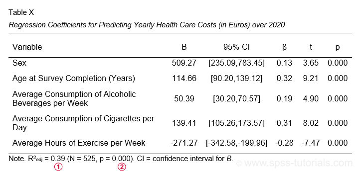

```{css, echo = FALSE}
.remark-slide-content {
  font-size: 30px;
  padding: 20px 20px 20px 20px;
}
.remark-code, .remark-inline-code {
  background: #f0f0f0;
}
.remark-code {
  font-size: 16px;
}
.huge .remark-code { /*Change made here*/
  font-size: 500% !important;
}
.tiny .remark-code { /*Change made here*/
  font-size: 11px !important;
}

.large { font-size: 130% }
.small { font-size: 80% }

.my-one-page-font {
  font-size: 24px;
}

.Rtable1 {
    font-family: "Lucida Console", Monaco, monospace;
    border-collapse: collapse;
    font-size: 9pt;
}
```

```{r setup, include=FALSE}
options(htmltools.dir.version = FALSE, device = 'svg', comment = NA)
```

```{r xaringan-themer, include=FALSE, warning=FALSE}
library(xaringanthemer)
style_duo_accent(
  primary_color = "#673888",
  secondary_color = "#FF961C",
  inverse_header_color = "#E5E5E5",
  background_color = "#E5E5E5",
  title_slide_background_color = "#E5E5E5",
  title_slide_text_color = "#673888"
)
```

```{r, echo=FALSE, result='hide', message = FALSE, comment=NA}
library(tidyverse)
library(ggplot2)
library(data.table)
library(magrittr)
library(knitr)
library(kableExtra)
library(table1)
library(GGally)
```

# Variables and Constants

.large[
- Any characteristic that varies from one individual to another can be called a *variable*.
- Social and health research is concerned with relations among variables.
- An example of a variable is sleep latency -- the time it takes an individual to fall asleep.
- If sleep latency were exactly the same for all people, it would be a *constant*.
]
---

# Scales of Measurement
.large[
- Measurement is a system for assigning values to observations (people) in a consistent and reproducible way.
- Measurement need not involve numbers as it could consist of classifying objects (people) into distinct categories (e.g., urban vs. rural residence).
]
---

# Continuous and Discrete Variables
.large[
- A variable which can take on any value within a specified range for a particular object (person) is a continuous variable.
- A variable (e.g., charisma) may be theoretically continuous even though a particular measurement of the variable may have only ordinal properties.
- Thus, it is important not to confuse the variables with the scales with which they are measured.
]
---

class: middle,center

```{r, echo=FALSE, results='hide'}
sitting <- read.csv("sitting.csv")
```

```{r, echo=FALSE, fig.width = 8, fig.asp = 0.7, fig.align='center', dev='svg'}
ggplot(sitting, aes(x = sitting, y = MTL)) +
  geom_point(size = 3, color = "#673888") +
  scale_x_continuous(limits=c(0,16), breaks = 0:16) +
  labs(x = "Hours/Day Spent Sitting", y = "Medial Temporal Lobe Thickness") +
  theme_minimal()
```
---

# Simple linear regression model

$$Y_{i}=\beta_0 + \beta_1 X_{i} + \epsilon_{i}$$

- $\beta_0$ is an intercept
- $\beta_1$ is a slope (regression coefficient)
- $Y_{i}$ is an outcome, response, or dependent variable score for person *i*
- $X_{i}$ is a predictor, explanatory, or independent variable score for person *i*
- $\epsilon_{i}$ is a residual for person *i*, the difference between between $Y_{i}$ and $\beta_0 + \beta_1 X_{i}$
---

# A simple linear regression model in R

.pull-left[
```{r, message = FALSE, comment=NA}
slrm <- lm(MTL ~ sitting, data = sitting)
summary(slrm)
```
]

.pull-right[
- More sitting associated with decreased MTL thickness
- Each additional hour of sitting associated with **decrease** of about 0.02 in thickness
- Allows us to draw a line through the scatterplot
]
---

class: middle,center

```{r, echo=FALSE, message=FALSE, fig.width = 8, fig.asp = 0.7, fig.align='center', dev='svg'}
ggplot(sitting, aes(x = sitting, y = MTL)) +
  geom_point(size = 3, color = "#673888") +
  scale_x_continuous(limits=c(0,16), breaks = 0:16) +
  labs(x = "Hours/Day Spent Sitting", y = "Medial Temporal Lobe Thickness") +
  geom_smooth(method = "lm", se=FALSE, color="red") +
  theme_minimal()
```
---

# Multiple Regression

For $k$ independent variables, the equation for multiple regression is:

$$Y=a + b_1X_1 + b_2X_2 + ... + b_kX_k + e$$
where
- $a$ is an intercept
- $b$s are regression coefficients applied to the $k$ $X$s
- $e$ is a residual or error

---

# Aggression Data
```{r, message = FALSE, comment=NA, echo=FALSE}
agg <- read.table("aggression.dat", sep = "\t")

colnames(agg) <- c('age', 'BPAQ', 'AISS', 'alcohol', 'BIS', 'NEOc', 'gender', 'NEOo')

agg$gender <- car::recode(agg$gender, "1='Female';0='Male'", as.factor = TRUE)

setDT(agg)

label(agg$age) <- "Age in Years"
label(agg$BPAQ) <- "Buss-Perry Aggression Questionnaire"
label(agg$BIS) <- "Barratt Impulsiveness Scale"
label(agg$AISS) <- "AISS"
label(agg$alcohol) <- "Alcohol"
label(agg$NEOc) <- "NEO Personality Conscientiousness"
label(agg$NEOo) <- "NEO Personality Openness" 
label(agg$gender) <- "Gender"

table1(~ ., data = agg[, .(BPAQ, BIS, age)])
```

---

```{r, echo=FALSE, fig.width = 9, fig.asp = 0.6, fig.align='center', dev='svg'}
ggpairs(data = subset(agg, select = c(BPAQ, BIS, age)))
```

---

# Fit and Summarize a Multiple Regression Model
```{r, message = FALSE, comment=NA}
fm1 <- lm(BPAQ ~ age + BIS, data = agg)

summary(fm1)
```

---

# ANOVA Table for Multiple Regression
```{r, message = FALSE, comment=NA}
anova(fm1)
```

---

# Cholesterol Data
```{r, message = FALSE, comment=NA, echo=FALSE}
DT <- readr::read_csv("ex0222.csv", col_types = c("i","f"))

table1::table1(~ CHOLESTEROL | GROUP, data = DT)
```

```{r, eval=FALSE, echo=FALSE, results='hide'}
setDT(DT)

DT[, .(`Mean Cholesterol` = round(mean(CHOLESTEROL),1), SD = round(sd(CHOLESTEROL), 1), N = .N), by = .(GROUP)] %>%
  .[,.(GROUP, N, `Mean Cholesterol`, SD)] %>%
kable(format="html") %>%
kable_styling("striped", full_width = FALSE, font_size = 28)
```
---

class: middle, center

```{r, echo=FALSE, fig.width = 12, fig.asp = 0.3, fig.align='center', dev='svg'}
ggplot(DT, aes(x = GROUP, y = CHOLESTEROL)) + 
  geom_boxplot(outlier.colour = "transparent", fill = "transparent") +
  geom_jitter(shape = 1, size = 2, position = position_jitter(width = .10, height = 0), color = "#673888") +
  labs(x = "", y = "Cholesterol") +
  coord_flip() +
  theme_minimal()
```
---

# t-tests

```{r, message = FALSE, comment=NA}
t.test(CHOLESTEROL ~ GROUP, data = DT, var.equal = TRUE)
```

---

# Modified t-tests
- There is a version of the t-test which does not assume equal variances in the groups compared (Welch's t-test)
- That version is the default in R

```{r, message = FALSE, comment=NA}
t.test(CHOLESTEROL ~ GROUP, data = DT)
```

---

# t-tests are a special case of Analysis of Variance
```{r, message = FALSE, comment=NA}
summary(aov(CHOLESTEROL ~ GROUP, data = DT))
```

$$F=t^2$$ 
when there are only two groups

```{r, message = FALSE, comment=NA}
sqrt(65.26)
```

---

# ANOVA and t-tests are both special cases of linear models 
```{r, message = FALSE, comment=NA}
summary(lm(CHOLESTEROL ~ GROUP, data = DT))
```
---

# Dummy Coding
```{r, message = FALSE, comment=NA}
DT$URBAN <- ifelse(DT$GROUP == "URBAN", 1, 0)

summary(lm(CHOLESTEROL ~ URBAN, data = DT))$coefficients
```

- Intercept is the mean cholesterol of the reference category group (rural)
- URBAN coefficient is the difference between the urban group mean and the reference category mean
---

# Effect Coding 
```{r, message = FALSE, comment=NA}
DT$URBAN <- ifelse(DT$GROUP == "URBAN", 1, -1)

summary(lm(CHOLESTEROL ~ URBAN, data = DT))$coefficients
```

- Intercept is the *unweighted* mean of the group means
- URBAN coefficient is the difference between the urban group mean and the *unweighted* mean of the group means
---

class: middle, center

# Poison Data (n=48)
```{r, message = FALSE, comment=NA, echo=FALSE}
pois <- read.csv("poison.csv", header = TRUE, colClasses = c("factor","factor","numeric","integer","integer"))

setDT(pois)

pois[, .(N = .N, `Mean Survival Time` = round(mean(SURVTIM),3), SD = round(sd(SURVTIM),3)), by = .(TREATMEN,POISON)] %>%
  knitr::kable(format = "html") %>%
kable_styling(full_width = FALSE, font_size = 14)
```
---

class: middle, center

```{r, echo=FALSE, fig.width = 9, fig.asp = 0.6, fig.align='center', dev='svg'}
ggplot(pois, aes(x = POISON, y = SURVTIM, color = TREATMEN)) + 
  geom_point(size=3, alpha = 1/2) + 
  facet_wrap(~ TREATMEN, nrow = 1) +
  labs(color = "Treatment", x = "Poison", y = "Survival Time") +
  theme_minimal()
```
---

# Interaction Effects 

```{r, message = FALSE, comment=NA}
fm2 <- lm(SURVTIM ~ POISON*TREATMEN, data = pois)
anova(fm2)
```
---

# Pairwise Comparisons After Fitting
```{r, message = FALSE, comment=NA}
library(emmeans)

pairs(emmeans(fm2, ~ TREATMEN))
```
---

# Planned Contrasts After Fitting
```{r, message = FALSE, comment=NA}
emmeans::contrast(emmeans(fm2, ~ TREATMEN), 
               list(`A vs. B,C,D` = c(1/1, -1/3, -1/3, -1/3), 
                    `A,C vs. B,D` = c(1/2, -1/2,  1/2, -1/2)))
```
---

# Interpretation of regression coefficients

- The intercept coefficient (or constant) is the mean of the outcome when all variables on the right-hand side of the linear regression are held constant at 0
- Each of the other coefficients represents how the mean of the outcome changes for a 1-unit change in the variable
- When the explanatory variable is a dummy variable, the unstandardized coefficient is a mean difference on the outcome variable

---

# Unstandardized and Standardized Coefficients
- Unstandardized coefficients (*B*) are based on the raw units of the IVs and the DV.
- The unstandardized coefficient (*B*) is interpreted as the increase in the DV expected for a single unit increase in the IV.
- A standardized coefficient ( $\beta$ ) is interpreted as the increase in the DV, expressed in z scores, expected for a single standard deviation increase in the IV.

.center[
$\beta = B*\frac{sd_x}{sd_y}$ , $B = \beta*\frac{sd_y}{sd_x}$
]
---

# Prediction from the model
- For any hypothetical case/observation, one can combine a covariate pattern with the model coefficients for a prediction
- For the aggression linear model, what should we predict for an individual with BIS=3 and age=18?     

.pull-left[
```{r}
coef(fm1)
```
]

.pull-right[
```{r}
1.95439237 + -0.01755627*18  + 0.44360694*3
```
]

```{r}
predict(fm1, newdata = expand.grid(age = c(17,18), BIS = c(3,4)))
```

---

# Linear model residuals
```{r, message = FALSE, echo=FALSE, fig.width = 6, fig.asp = 0.6, fig.align='center', dev='svg'}
ggplot(data.frame(resid = resid(fm1)), aes(x = resid)) + 
  geom_histogram(color = "white", fill = "#673888") + 
  labs(x = "Residual", y = "Number of People") +
  theme_minimal()
```

- Typically off by a small amount, but sometimes a large over- or under-estimate of BPAQ

---

class: my-one-page-font

# How accurate is our prediction?
.pull-left[
- Residual standard error (standard deviation of residuals) measures the typical difference between a model prediction and an observed value
- Plot observed values against predicted values
- On the 1-4 BPAQ scale, prediction is typically off by +/-0.5 (not great!)
]

.pull-right[
```{r, message = FALSE, echo=FALSE, fig.width = 4, fig.asp = 1, fig.align='center', dev='svg'}
agg$Predicted_BPAQ <- predict(fm1)
ggplot(agg, aes(x = Predicted_BPAQ, y = BPAQ)) +
  geom_point(size = 2, color = "#673888", alpha = 1/4) +
  scale_x_continuous(limits=c(1.5,3.5), breaks=seq(1.5,3.5,0.5)) +
  scale_y_continuous(limits=c(1,4.2), breaks=1:4) +
  labs(x = "Model Predicted BPAQ", y = "Observed BPAQ") +
  geom_smooth(method = "lm", se=FALSE, color="red") +
  theme_minimal()
```
]

---

# The Squared Multiple Correlation, $R^2$
.small[
.pull-left[
- A number between zero and one summarizing how much of the outcome variable's variance is explained by the model
- An effect size for a group of explanatory variables or ( with increments in $R^2$ ), individual explanatory variables
- Can only stay the same or increase as additional variables are added on the right-hand side
- Adjusted $R^2$ penalizes models for being overly complex
]
.pull-right[
$$R^2=\frac{VAR(Y)-VAR(e)}{VAR(Y)}$$
$$Adjusted R^2=1-(1-R^2)\frac{N-1}{N-P-1}$$
]
]
---

# Example Regression Table
.center[

]
- Descriptive statistics for outcome and explanatory variables are typically in a separate table
---

# Assumptions of Linear Model
- Linearity
- For standard inference, normally distributed residuals
- For standard inference, homoscedasticity (i.e., constant variance of residuals across values of explanatory variables)
- Residuals are independent

---

# Diagnostics and Workarounds for Linear Model Assumptions
- Visualize distribution of residuals
- Plot residuals against explanatory variables to look for differences in residual variance across explanatory variable
- Transformations of outcome and/or explanatory variables
- Bootstrapping for inference

---

```{r, echo=FALSE, message=FALSE, fig.width = 7, fig.asp = 0.8, fig.align='center', dev='svg'}
agg$Residuals <- resid(fm1)
ggplot(agg, aes(x = BIS, y = Residuals)) +
  geom_point(size = 2, color = "#673888", alpha = 1/4) +
  labs(x = "Barratt Impulsiveness Scale", y = "Residuals") +
  geom_smooth(se=FALSE, color="red") +
  theme_minimal()
```

---

# Model building strategies

.pull-left[
- Depends on your inferential goal (prediction, primary exposure effect, relative importance)
- Bivariate screening (not recommended)
- Forward stepwise (not recommended)
- Backward elimination (if you must simplify)
- Change in coefficient estimates
]

.pull-right[
- Simplify right-hand side as much as possible without considering the outcome
- Allow for non-linear and interaction terms
- Rule of thumb: ten observations per **candidate** predictor
- Model selection complicates statistical inference
- See E. Vittinghoff et al., _Regression Methods in Biostatistics_ (Chapter 10)
]

---

# Type I, II, & III Sums of Squares
.small[
- **Type I** sum of squares use a hierarchical build up approach to estimate the overall significance of each effect. The investigator must determine the sequence in which factor $A$ and factor $B$ will be entered.
- **Type II** sum of squares uses a modified hierarchical approach. The main effect of factor $A$ is assessed controlling for factor $B$. The main effect of factor $B$ is assessed controlling for factor $A$. The interaction is assessed controlling for all lower-order terms (e.g., main effects of $A$ and $B$).
- **Type III** sum of squares compare the prediction of the full model ( $A$, $B$, $A*B$ ) to submodels in which only the effect of interest is eliminated. The difference
between Type II and Type III is that with Type III, other main effects and the interaction are controlled in assessing a particular main effect while with Type II, higher-order terms are not controlled when assessing lower-order terms.
]
---

# Demonstration of When Order of Entry Matters
.pull-left[
```{r, echo=TRUE, message = FALSE, comment=NA}
fm1a <- lm(BPAQ ~ age + BIS, data = agg)
fm1b <- lm(BPAQ ~ BIS + age, data = agg)
anova(fm1a)
```
]

.pull-right[
```{r, echo=TRUE, message = FALSE, comment=NA}
anova(fm1b)
```
]

- In **fm1a**, age gets the first shot at accounting for BPAQ variance, but in **fm1b** age must add to what BIS accounts for already

---

```{r, echo=TRUE, message = FALSE, comment=NA}
summary(fm1a)$coefficients
summary(fm1b)$coefficients
```
- Coefficients in the same model are evaluated adjusting for all other effects (i.e., as if entered last)

---

```{r, echo=TRUE, message = FALSE, comment=NA}
car::Anova(fm1a, type = "II")
car::Anova(fm1b, type = "II")
```

---

# Sample size, power, and effect size

- A modest population mean difference between groups requires a large sample size for reliable detection

```{r, comment=NA}
power.t.test(delta = .2, power = .8)
```

---

class: middle, center

# How sample size needed for 80% power changes as a function of effect size
```{r, echo=FALSE, message=FALSE, warning=FALSE, comment=NA}
library(data.table)

DT2 <- data.frame(es = seq(0.2,0.5,0.05))

setDT(DT2)
DT2[, Row := 1:.N]
DT2[,  n := ceiling(power.t.test(power = .8, delta = es)$n)*2, by = .(Row)]
DT2[, `Standardized Mean Difference` := es]
DT2[, `Sample Size for 80% Power` := n]
```

```{r, echo=FALSE, comment=NA}
DT2[,.(`Standardized Mean Difference`, `Sample Size for 80% Power`)] %>%
  knitr::kable(format = 'html', align = 'c') %>%
kable_styling(full_width = FALSE, font_size = 20)
```

---

class: middle, center

```{r, echo=FALSE, fig.height = 5, fig.asp = 0.8, fig.align='center', dev='svg'}
ggplot(DT2, aes(x = es, y = n)) + 
  geom_point(size = 3, color = "#673888") +
  geom_path(color = "#673888") +
  labs(x = "Standardized Mean Difference\nDetectable with 80% Power", y = "Total Sample Size") +
  scale_y_continuous(limits=c(0,800), breaks = seq(0,800,100)) +
  scale_x_continuous(limits=c(0.2,0.5), breaks = seq(0.2,0.5,0.05)) +
  theme_minimal() +
  theme(axis.text.x = element_text(size = 14, face = "bold"),
        axis.text.y = element_text(size = 14, face = "bold"),
        axis.title.x = element_text(size = 18, face = "bold"),
        axis.title.y = element_text(size = 18, face = "bold"),
        strip.text.x = element_text(size = 18, face = "bold"),
        legend.text=element_text(size=18, face = "bold"),
        legend.position = "right",
        legend.direction = "vertical",
        legend.title=element_text(size=20, face = "bold"))
```

---

# Some extensions of linear regression

- Robust linear models
- Generalized linear models
- Multilevel or mixed-effects regression
- Structural equation models

---

# References

.small[
- Baguley, T. (2012). Serious stats: A guide to advanced statistics for the behavioral sciences. Macmillan International Higher Education.
- Flora, D. B. (2017). Statistical methods for the social and behavioural sciences: A model-based approach. Sage.
- Fox, J. (2016). Applied regression analysis and generalized linear models(3rd ed.). Sage.
- Harrell, F.E. (2015). Regression Modeling Strategies: With Applications to Linear Models, Logistic and Ordinal Regression, and Survival Analysis. Springer.
- Pedhazur, E. J. (1997). Multiple regression in behavioral research: Explanation and prediction. Thompson Learning. Inc: New York, NY.
- Vittinghoff, E., Glidden, D.V., McCulloch, C.E., Shiboski, S.C. (2012). Regression Methods in Biostatistics: Linear, Logistic, Survival, and Repeated Measures Models. Springer.
]
---

class: center, middle

# Thanks!

Slides created via the R package [**xaringan**](https://github.com/yihui/xaringan).
